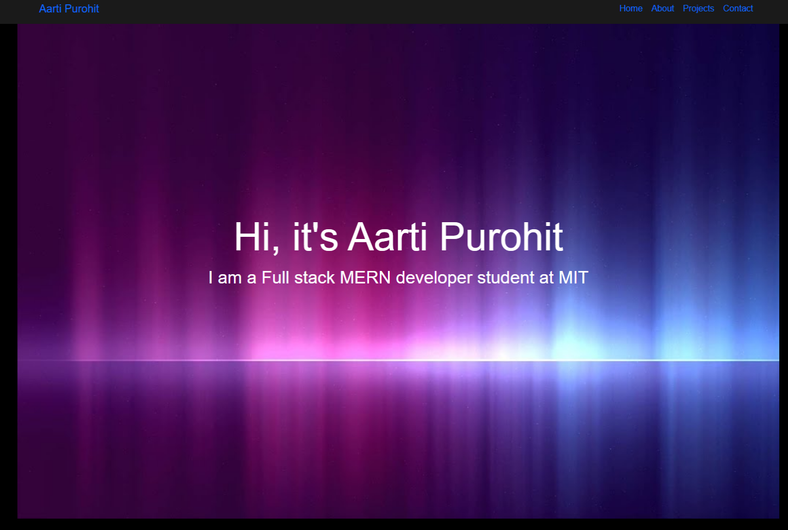

# Aarti0906.github.io

## Description
This is a portfolio webpage which includes my bio, projects and contact information. i also used bootstrap to create the webpage.

## How to Run
Fork the repository.
Clone the repository.
Install the dependencies by running npm install.
Run the project using npm start.
Open the project in your browser at http://localhost:3000.

## License
This project is licensed under the MIT License - see the LICENSE file for details.

